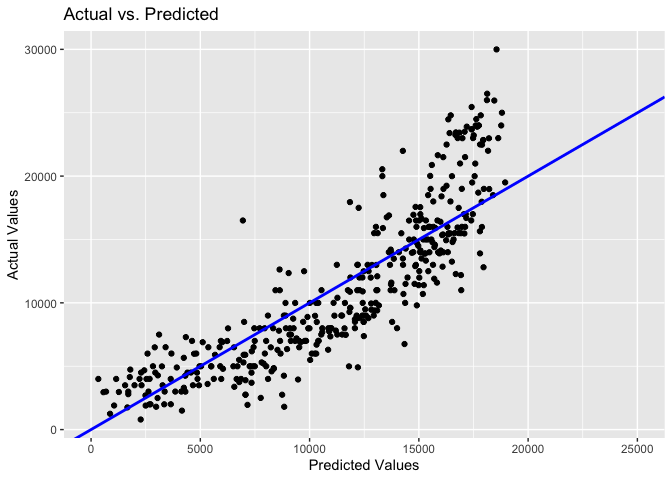
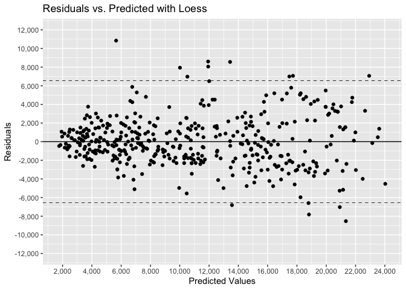

1.  [Get Chevrolet cars in a separate
    data.frame](#get-chevrolet-cars-in-a-separate-data.frame)
    -   [Fit a model](#fit-a-model)
    -   [Create Residual and Predicted
        variables](#create-residual-and-predicted-variables)
    -   \[Actual vs. predicted values\]
    -   \[Residuals vs. predicted\]
    -   \[Price vs. Miles\]
    -   [Loess fit object](#loess-fit-object)
    -   \[Plot of residuals vs. predicted with Loess\]
2.  \[Form separate data.frames for Impala and Malibu cars\]
    -   [Fitting a model for Impala and
        Malibu](#fitting-a-model-for-impala-and-malibu)
    -   [Set up data.frame in order to make predictions for every 10000
        miles](#set-up-data.frame-in-order-to-make-predictions-for-every-10000-miles)
    -   [Getting predictions for Impala’s and Malibu‘s
        vehicles](#getting-predictions-for-impalas-and-malibus-vehicles)
    -   [Create a plot of both regression
        lines](#create-a-plot-of-both-regression-lines)
    -   [Regression lines intersection point
        coordinates](#regression-lines-intersection-point-coordinates)

Libraries needed: dplyr, ggplot2, scales.

``` r
load("~/OneDrive - MNSCU/myGithub/Statistics/Regression_models/Fitting-Simple-Linear-Regression-Model-in-R/UsedCars.RData")
```

Get Chevrolet cars in a separate data.frame
-------------------------------------------

Apply a filter: I want only Chevrolets and am going to be only working
with Make, Price, and Miles variables.

``` r
(UsedCars
  %>% select(Make,Price,Miles)
  %>% filter(Make == "Chevrolet")
) -> UsedCars_Chevi
str(UsedCars_Chevi)
```

    ## 'data.frame':    433 obs. of  3 variables:
    ##  $ Make : Factor w/ 3 levels "Chevrolet","Honda",..: 1 1 1 1 1 1 1 1 1 1 ...
    ##  $ Price: int  20995 9992 3995 25992 8988 18500 11395 1800 4000 3800 ...
    ##  $ Miles: int  24826 111206 180000 11520 87000 62766 45304 175222 183430 212726 ...

### Fit a model

``` r
UsedCars_SLR <- lm(formula = Price ~ Miles, data=UsedCars_Chevi)
summary(UsedCars_SLR)
```

    ## 
    ## Call:
    ## lm(formula = Price ~ Miles, data = UsedCars_Chevi)
    ## 
    ## Residuals:
    ##     Min      1Q  Median      3Q     Max 
    ## -7594.0 -2326.7  -510.3  1927.9 11440.2 
    ## 
    ## Coefficients:
    ##               Estimate Std. Error t value Pr(>|t|)    
    ## (Intercept)  1.918e+04  2.867e+02   66.89   <2e-16 ***
    ## Miles       -9.248e-02  2.655e-03  -34.84   <2e-16 ***
    ## ---
    ## Signif. codes:  0 '***' 0.001 '**' 0.01 '*' 0.05 '.' 0.1 ' ' 1
    ## 
    ## Residual standard error: 3274 on 431 degrees of freedom
    ## Multiple R-squared:  0.7379, Adjusted R-squared:  0.7373 
    ## F-statistic:  1214 on 1 and 431 DF,  p-value: < 2.2e-16

### Create Residual and Predicted variables

``` r
(UsedCars_Chevi %>% 
    mutate(SLR.Residuals = UsedCars_SLR$residuals,
           SLR.Predicted = UsedCars_SLR$fitted.values)) -> Used_Cars_Chevi_Resid.Predict
```

### Create a plot of actual vs. predicted values

Set x-axis limit to start from 0 since price cannot be negative. This
will display a warning message: “Removed 18 rows containing missing
values (geom\_point).”

``` r
ggplot(Used_Cars_Chevi_Resid.Predict, aes(x = SLR.Predicted, y = Price)) +
  geom_point() +
  geom_abline(intercept = 0, slope = 1, lwd = 1, col = "blue") +
  xlim(0,25000) +
  labs(x = "Predicted Values", y = "Actual Values", title = "Actual vs. Predicted")
```



### Create a plot of residuals vs. predicted

Outliers estimation at &gt; +/- 2\*RMSE

``` r
#Get RMSE from the summary of fitted model UsedCars_SLR
summary = summary(UsedCars_SLR)
summary$sigma
```

    ## [1] 3273.574

``` r
#RMSE = 3274
2*3274
```

    ## [1] 6548

Thus, outliers will be the points whose residual values are greater than
6548 or smaller than - 6548.

``` r
ggplot(Used_Cars_Chevi_Resid.Predict, aes(x = SLR.Predicted, y = SLR.Residuals)) +
  geom_point() +
  geom_hline(yintercept = c(0)) +
  geom_hline(yintercept = c(-6548, 6548), lty = "dashed", lwd = 0.3) +
  coord_cartesian(ylim = c(-12000,12000)) +
  xlim(0,20000) +
  scale_y_continuous(labels = comma, breaks = pretty_breaks()) +
  labs(x = "Predicted Values", y = "Residuals", title = "Residuals vs. Predicted")
```


### Create a plot of Price vs. Miles

``` r
ggplot(Used_Cars_Chevi_Resid.Predict, aes(x = Miles, y = Price)) +
  geom_point() +
  geom_smooth(method = "loess" , se = FALSE) +
  scale_x_continuous(labels = comma, breaks = pretty_breaks()) +
  scale_y_continuous(labels = dollar_format(prefix="$"), breaks = pretty_breaks(n=10)) +
  labs(title = "Price vs. Miles")
```


### Loess fit object

``` r
Chevi_loess <- loess(formula = Price ~ Miles, data = UsedCars_Chevi)
(UsedCars_Chevi
  %>% mutate(Residuals_Loess = Chevi_loess$residuals,
             Predicted_Loess = Chevi_loess$fitted)
) -> Used_Cars_Chevi_Loess_Resid.Predict
```

### Create a plot of residuals vs. predicted with Loess

``` r
ggplot(Used_Cars_Chevi_Loess_Resid.Predict, aes(x = Predicted_Loess, y = Residuals_Loess)) +
  geom_point() +
  geom_hline(yintercept = c(0)) +
  geom_hline(yintercept = c(-6548, 6548), lty = "dashed", lwd = 0.3) +
  coord_cartesian(ylim = c(-12000,12000)) +
  labs(x = "Predicted Values", y = "Residuals", title = "Residuals vs. Predicted with Loess") +
  scale_x_continuous(labels = comma, breaks = pretty_breaks(n=10)) +
  scale_y_continuous(labels = comma, breaks = pretty_breaks(n=10))
```



Now, I am interested only in Impala and Malibu models. <br></br> \#\#
Form separate data.frames for Impala and Malibu cars

``` r
( UsedCars
  %>% select(Model,Price,Miles)
  %>% filter(Model == "Impala")
  %>% filter(Miles > 20000 & Miles < 120000)
) -> UsedCars_Impala
```

``` r
( UsedCars
  %>% select(Model,Price,Miles)
  %>% filter(Model == "Malibu")
  %>% filter(Miles > 20000 & Miles < 120000)
) -> UsedCars_Malibu
```

### Fitting a model for Impala and Malibu

``` r
UsedCars_Impala_SLR <- lm(formula = Price ~ Miles, data=UsedCars_Impala)
UsedCars_Malibu_SLR <- lm(formula = Price ~ Miles, data=UsedCars_Malibu)
```

### Set up data.frame in order to make predictions for every 10000 miles

``` r
UsedCars_NewPrediction <- data.frame(Miles = c(20000,30000,40000,50000,60000,70000,80000,90000,100000,110000,120000))
```

### Getting predictions for Impala’s and Malibu‘s vehicles

``` r
( UsedCars_NewPrediction
  %>% mutate(Impala_Predictions = predict(UsedCars_Impala_SLR,newdata=UsedCars_NewPrediction) )
  %>% mutate(Malibu_Predictions = predict(UsedCars_Malibu_SLR,newdata=UsedCars_NewPrediction) )
) -> UsedCars_NewPrediction
```

### Create a plot of both regression lines

``` r
ggplot(UsedCars_NewPrediction, mapping=aes(x=Miles,y=Impala_Predictions)) +
  geom_line(mapping=aes(x=Miles,y=Impala_Predictions)) + 
  geom_line(mapping=aes(x=Miles,y=Malibu_Predictions),linetype="dashed")+ 
  labs(x = "Miles", y = "Predictions by Model", title="Predictions by Model vs. Miles") +
  scale_x_continuous(labels = comma, breaks = pretty_breaks(n=10)) +
  scale_y_continuous(labels = dollar_format(prefix="$"), breaks = pretty_breaks(n=10))
```


Dashed: Malibu Regular: Impala

### Regression lines intersection point coordinates

Find at how many miles Malibu becomes more expensive than Impala. I.e.
find the coordinates of a point where the 2 regression lines intersect.

Form a coefficient matrix ‘cm’ using coefficients from the output of
lm() function: UsedCars\_Impala\_SLR and UsedCars\_Malibu\_SLR.

``` r
cm <- rbind(coef(UsedCars_Impala_SLR),coef(UsedCars_Malibu_SLR)) 
c(-solve(cbind(cm[,2],-1)) %*% cm[,1])
```

    ## [1] 89508.494  9238.901

Plug in the intersection point to check.

``` r
ggplot(UsedCars_NewPrediction, mapping=aes(x=Miles,y=Impala_Predictions)) +
  geom_line(mapping=aes(x=Miles,y=Impala_Predictions)) + 
  geom_line(mapping=aes(x=Miles,y=Malibu_Predictions),linetype="dashed")+ 
  labs(x = "Miles", y = "Predictions by Model", title="Predictions by Model vs. Miles") +
  scale_x_continuous(labels = comma, breaks = pretty_breaks(n=10)) +
  scale_y_continuous(labels = dollar_format(prefix="$"), breaks = pretty_breaks(n=10)) +
  geom_point(aes(x=89508.494, y=9238.901), colour="blue", size =3) 
```


Dashed: Malibu Regular: Impala <br></br> Malibu is cheaper that Impala
when it has less than 89,508 miles. When it has more than that, it
becomes more expensive than Impala.
